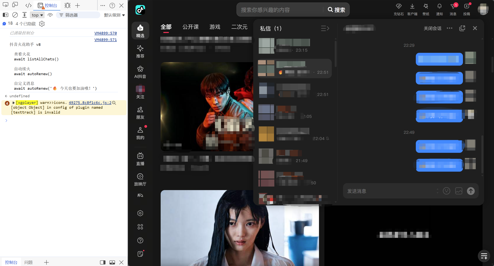

# Douyin Streak Keeper（抖音火花续火助手）

一个在抖音网页版运行的浏览器控制台脚本，支持 Google Chrome、Microsoft Edge 和 Mozilla Firefox（推荐使用Google Chrome）。它会扫描私信列表中的火花状态，找出灰色火花会话，并在 3 秒倒计时后逐一发送续火消息。无需安装依赖，也不需要填写 Cookie 或 Token。

> [!WARNING]
> 本项目是非官方工具，与抖音及其关联公司无关。网页结构或平台规则变化可能导致脚本失效。使用前请了解并遵守抖音用户协议，不要用于骚扰、群发广告或其他滥用行为。

## 功能

- 自动滚动并扫描火花会话
- 区分灰色火花与已点亮火花
- 至少发现一名火花好友后，连续 3 次没有发现新的灰色火花时自动停止扫描
- 发送前展示收件人数和消息内容，并等待 3 秒
- 使用完整昵称匹配会话，避免短昵称误匹配包含该文字的其他用户
- 支持自定义续火消息
- 不读取或保存 Cookie、密码等登录凭据

## 运行要求

- 桌面版 Google Chrome、Microsoft Edge 或 Mozilla Firefox
- 已登录的抖音网页版账号
- 基本的浏览器开发者工具操作能力

## 浏览器兼容性

| 浏览器 | 支持状态 |
| --- | --- |
| Google Chrome（桌面版） | 已支持 |
| Microsoft Edge（桌面版） | 已支持 |
| Mozilla Firefox（桌面版） | 已支持 |
| Safari | 暂未适配 |

Chrome 使用 Slate 编辑器发送流程；Edge 和 Firefox 使用 Draft.js 兼容流程。（Edge和Firefox没有Chrome稳定。）

## 快速开始
运行示例：

运行步骤：
1. 下载或打开 [`douyin-streak-keeper.js`](./douyin-streak-keeper.js)，复制完整脚本内容。
2. 登录[抖音网页版](https://www.douyin.com/)，点击右上角**消息**，等待会话列表加载完成，随机打开一个好友会话，并把会话左侧好友列表弹开（chrome浏览器无需手动弹开）。
3. 按 `F12` 打开开发者工具，切换到 **Console（控制台）**。
4. 将脚本粘贴到控制台并按回车执行。
5. 使用下面的命令查看或续火。

首次向控制台粘贴代码时，浏览器可能显示安全警告。请先阅读并确认脚本内容，不要粘贴来源不明的代码。

### 仅查看火花状态

```js
await listAllChats();
```

### 使用默认消息自动续火

```js
await autoRenew();
```

默认消息为：

```text
🔥
```

### 使用自定义消息

```js
await autoRenew('🔥 今天也要加油哦！');
```

脚本扫描完成后会显示发送人数和消息内容，并在 3 秒后自动开始发送。需要取消时，请在倒计时结束前刷新页面或关闭标签页。

## 扫描策略

脚本按照“续火用户通常集中在会话列表顶部”的特点进行快速扫描：

- 每次向下滚动约 `200–300px`
- 连续 `3` 次没有发现新的灰色火花时停止扫描
- 最多滚动 `30` 次，避免异常情况下无限循环
- 到达会话列表底部时立即停止

这些数值保留在 `loadChatsUntilNoNewGray()` 函数中，与原版脚本一致。

## 工作流程

```text
加载脚本 → 扫描会话 → 展示结果 → 等待 3 秒 → 切换会话并发送
```

脚本只处理当前页面已加载或可通过滚动加载的会话。控制台显示“已发送”表示脚本已经执行发送操作，不代表服务端一定接收成功，请在私信页面抽查结果。

## 常见问题

### 提示“未找到消息输入框”或“未找到会话”

抖音网页版的页面结构可能已经变化。请刷新页面后重试；如果问题持续存在，可以提交 Issue，并附上错误信息、浏览器版本和复现步骤。请勿提交 Cookie、手机号、用户昵称截图或其他隐私信息。

### 扫描结果不完整

先确认私信列表已经加载。脚本至少发现一名火花好友后，连续 3 次没有发现新的灰色火花才会停止；尚未发现任何火花时会继续扫描。续火用户没有集中在顶部时，可以在 `loadChatsUntilNoNewGray()` 中调整 `maxNoNewGray`。

### 提示“未找到”某个用户

脚本会滚动会话列表并按昵称查找用户。网络加载较慢或抖音页面结构发生变化时，可能无法找到目标会话；请刷新页面并等待会话列表加载后重试。

### 刷新页面后命令不可用

控制台脚本不会永久安装。每次刷新或重新打开页面后，都需要重新粘贴并执行脚本。

## 隐私与安全

- 脚本完全在当前浏览器标签页内运行，没有内置服务器或数据上传逻辑。
- 不要把包含 Cookie、Token、手机号或聊天记录的内容提交到 GitHub。
- 建议先运行 `listAllChats()` 核对扫描结果，再执行 `autoRenew()`。
- 控制发送频率，避免对好友造成打扰或触发平台限制。

## 项目结构

```text
.
├── douyin-streak-keeper.js  # 浏览器控制台脚本
├── README.md                # 项目说明
├── .gitattributes           # Git 换行规则
└── .gitignore               # Git 忽略规则
```

## 发布到 GitHub

确认脚本中没有个人信息后，在仓库目录执行：

```bash
git add douyin-streak-keeper.js README.md .gitattributes .gitignore
git commit -m "docs: prepare project for GitHub"
git remote add origin https://github.com/<你的用户名>/<仓库名>.git
git push -u origin main
```

如果已经配置过 `origin`，不要重复执行 `git remote add origin`。建议在 GitHub 仓库简介中注明“抖音网页版控制台脚本”。

## 贡献

欢迎通过 Issue 报告页面兼容性问题，也欢迎提交 Pull Request。提交前请确认没有包含任何账号凭据或个人信息，并说明测试使用的浏览器版本。

## 免责声明

本项目仅供学习和个人效率用途，按“现状”提供，不保证持续可用。因使用本项目产生的账号限制、消息误发、数据损失或其他后果，由使用者自行承担。

## 开源许可

当前仓库未附带开源许可证。在添加许可证之前，其他人默认没有复制、修改或再分发本项目代码的授权。准备公开协作时，请选择并添加适合你的许可证。
